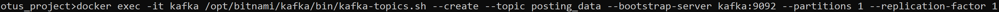
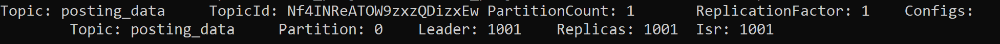
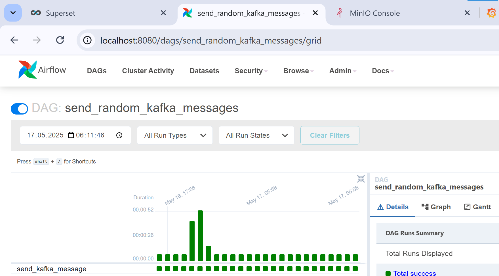
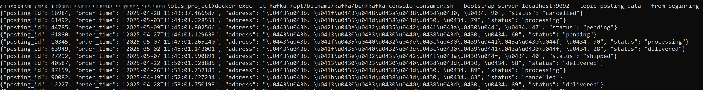
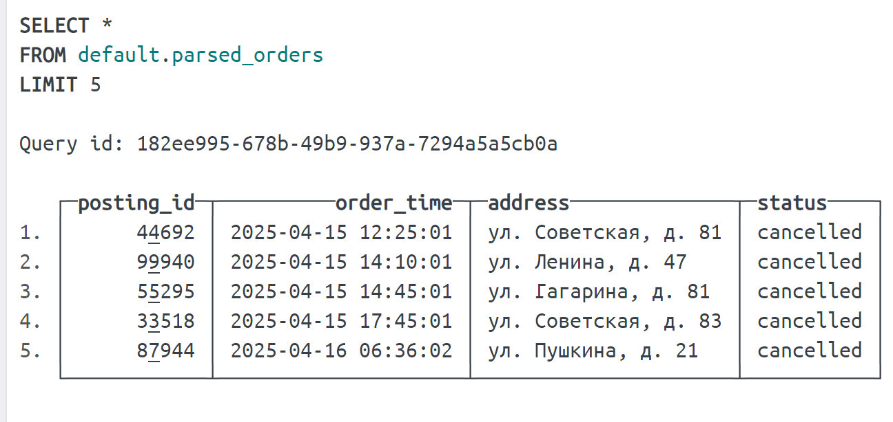
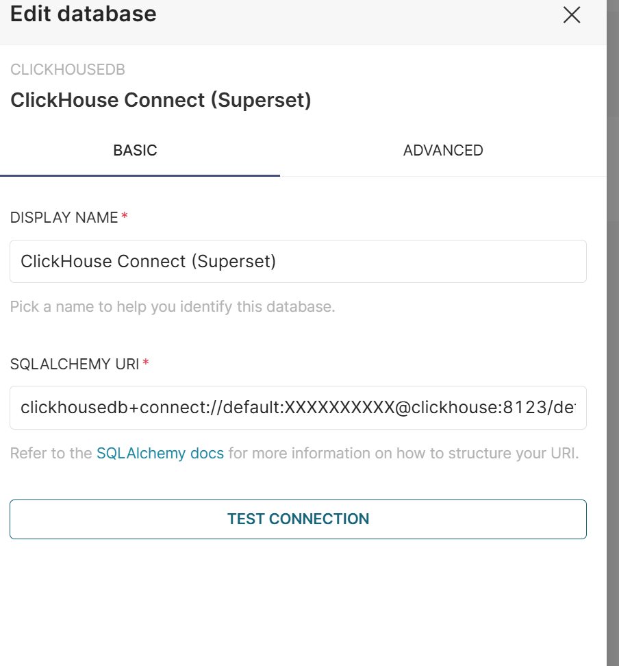
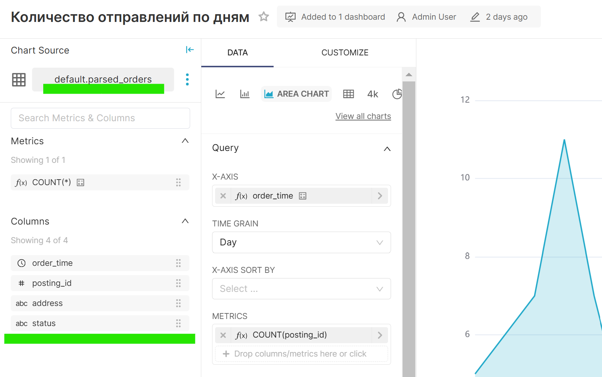

Единая система из сервисов Clickhouse, Kafka, Airflow + Postgres, Prometheus + Grafana, S3 для резервного копирования, Superset.

### Подготовка инфраструктуры

1. Описание сервисов Kafka, Grafana, Superset в `docker-compose` для запуска и согласованной работы в изолированной среде.
2. Объединение с частью, подготовленной коллегой.
3. Топик, даг-генератор для отправки сообщений в топик.
4. Флоу в Clickhouse для чтения сообщений и базы для построения визуальных отчетов в Superset.
5. Добавление датасорса в Superset и визуализация данных.

### Шаги

1. Создание топика в Kafka:
   ```bash
   docker exec -it kafka /opt/bitnami/kafka/bin/kafka-topics.sh --create --topic posting_data --bootstrap-server kafka:9092 --partitions 1 --replication-factor 1
   ```
   
   

2. Написан `DAG` ([posting_message.py](otus_project/dags/posting_message.py)) с генерацией примитивных сообщений в топик и запуском в Airflow. Ежеминутно отправляется 1 сообщение.
   

3. Проверка получаемых сообщений в Kafka CLI:
   

4. Настраиваем чтение в Clickhouse:
   1. Таблица `kafka_source` (Kafka Engine):
   ```sql
   CREATE TABLE IF NOT EXISTS default.kafka_source
   (
       posting_id Int64,
       order_time String,
       address String,  -- Исправлено: было "adress"
       status String
   )
   ENGINE = Kafka()
   SETTINGS
       kafka_broker_list = 'kafka:9092',
       kafka_topic_list = 'posting_data',
       kafka_group_name = 'o_group',
       kafka_format = 'JSONEachRow',
       kafka_row_delimiter = '\n';
   ```

   2. Материализованное представление:
   ```sql
   CREATE MATERIALIZED VIEW default.orders_mv TO default.parsed_orders
       AS SELECT posting_id,
           parseDateTimeBestEffort(order_time) AS order_time,
           address,
           status
       FROM default.kafka_source;
   ```

   3. Таргетная таблица:
   ```sql
   CREATE TABLE IF NOT EXISTS default.parsed_orders
   (
       posting_id Int64,
       order_time DateTime,
       address String,
       status String
   )
   ENGINE = MergeTree()
   ORDER BY (status, order_time, posting_id);
   ```
   

5. Подключение датасорса в Superset и визуализация получаемых данных:
   
   Пример чарта, построенного на таблице в Clickhouse:
   

--- 

Теперь текст структурирован и форматирован в соответствии с Markdown.
